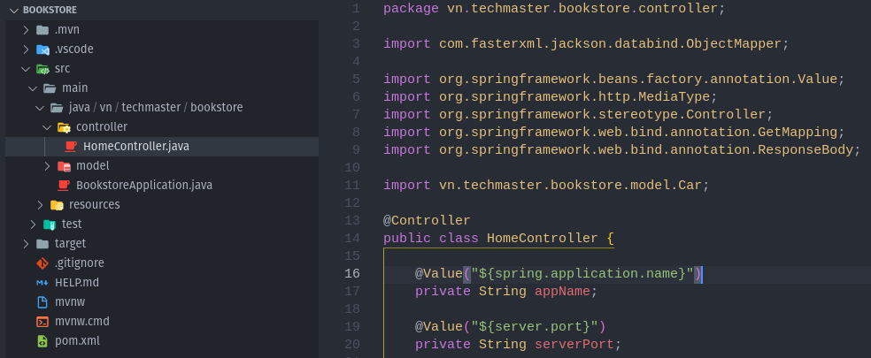
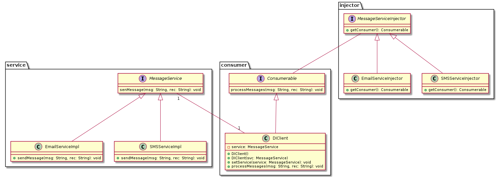
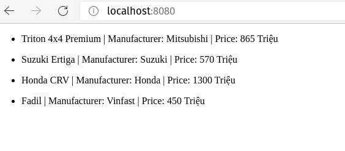

## Folder Structure

The workspace contains two folders by default, where:
- `car-dealer`: bài 1 - hiển thị danh sách xe
- `demo-annotation`: tạo @MyNumberAnnotaion
- `readcsv`: bài 3 - đọc data từ csv, hiển thị danh sách
- `out`: diagram hiểu về dependency injection
- `src`: the folder to maintain sources
- `lib`: the folder to maintain dependencies
- `assignment.md`: đề bài

## Khởi tạo một project Spring Boot bằng VS Code

- Nhấn tổ hợp phím `Shift` + `Ctrl` + `P` hoặc phím `F1`: Hiển thị bảng lệnh
- Nhập vào `spring init`: chọn `Spring Initializr: Create a Maven Project`
- Chọn phiên bản Spring Boot: `2.4.5` 
- Chọn ngôn ngữ: `Java`
- Nhập vào `Group Id`: `vn.techmaster`  hoặc tùy chọn
- Nhập vào tên project `Artifact Id`
- Chọn kiểu dóng gói ứng dụng: `Jar` hoặc `War`
- Chọn phiên bản Java:`11` `16` `8` hoặc tùy chọn
- Chọn `Dependencies`: `Spring Web`, `Spring Boot DevTools`, `Lombok` và `Thymeleaf`
- Chọn thư mục để generate dự án.

- `pom.xml` file:

```xml
<dependencies>
		<dependency>
			<groupId>org.springframework.boot</groupId>
			<artifactId>spring-boot-starter-thymeleaf</artifactId>
		</dependency>
		<dependency>
			<groupId>org.springframework.boot</groupId>
			<artifactId>spring-boot-starter-web</artifactId>
		</dependency>
		<dependency>
			<groupId>org.springframework.boot</groupId>
			<artifactId>spring-boot-devtools</artifactId>
			<scope>runtime</scope>
			<optional>true</optional>
		</dependency>
		<dependency>
			<groupId>org.projectlombok</groupId>
			<artifactId>lombok</artifactId>
			<optional>true</optional>
		</dependency>
		<dependency>
			<groupId>org.springframework.boot</groupId>
			<artifactId>spring-boot-starter-test</artifactId>
			<scope>test</scope>
		</dependency>
		<dependency>
			<groupId>com.fasterxml.jackson.core</groupId>
			<artifactId>jackson-databind</artifactId>
		  </dependency>
	</dependencies>
```

## Chạy ứng dụng demo
|Ứng dụng|Method|Return|
|---|---|---|
|demo02|- getHome()<br/>- getAbout()|- String - không qua View Engine<br/>- String - không quaView Engine|
|demo03|- getHome(), getAbout()<br/>- getXml(), getJson()<br/>- getBook(),  getCar(), getPerson()|- String - không qua View Engine<br/>- String - kiểu giá trị JSON & XML<br/>- String - được convert bởi thư viện Jackson, không qua View Engine|
|demo04|- private String appName;<br/>- private String port;|- Được đánh dấu giá trị với spring.application.name<br/>- Được đánh dấu giá trị với server.port|
|demo05|||

## Hiểu về dependency injection - demo07


## Bài tập 01 - Car Dealer hiển thị danh sách xe


## Bài tập 03 - Đọc dữ liệu từ CSV, hiển thị danh sách xe
`car.csv`

``` csv
1,Triton 4x4 Premium,Mitsubishi,865
2,Suzuki Ertiga,Suzuki,570
3,Honda CRV,Honda,1300
4,Fadil,Vinfast,450
```

