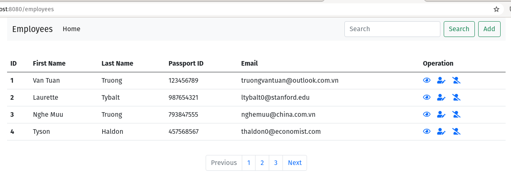
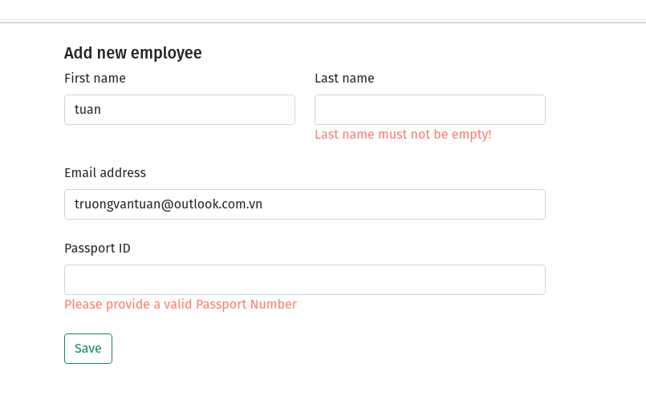
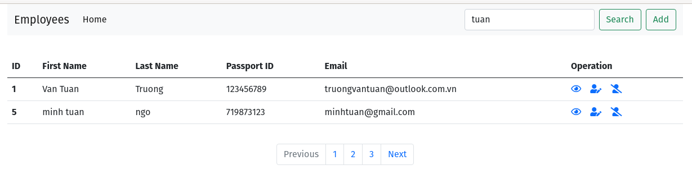

Spring Boot - Employee Management
===============================

Ứng dụng Employee Management gồm employee RESTful API và Spring MVC Thymeleaf

Technology stack:

* Spring Boot
* Spring MVC
* Spring Data JPA
* Spring Hateoas
* OpenAPI
* Bootstrap
* Thymeleaf
* Lombok

## Requirements

* JDK 11
* Apache Maven

## Lấy về mã nguồn

```
https://downgit.github.io/#/home?url=https://github.com/truongvantuan/springboot-assignment-techmaster/tree/main/assignment_03/employeemanager
```

## Chạy ứng dụng

Chạy ứng dụng bằng command line như sau:

### Chạy ứng dụng RESTfull API.

* Chạy ứng dụng RESTfull API.
   ```shell
   ./mvnw spring-boot:run
   ```
  
* Open API - Swagger chạy tại http://localhost:8080/swagger-ui.html
  
* Ứng dụng chạy tại [http://localhost:8080](http://localhost:8080/)
  
  - Chạy lệnh sau lấy về tất cả employee có id la 1
  ```shell
  curl http://localhost:8080/api/employees/1 | json_pp
  ```
  
  - Kết quá:
  ```json
  {
  "id": 1,
  "firstName": "Tuan",
  "lastName": "Truong",
  "email": "truongvantuan@outlook.com.vn",
  "passportNumber": "123456789",
  "_links": {
    "self": {
      "href": "http://localhost:8080/api/employees/1"
    },
    "employees": {
      "href": "http://localhost:8080/api/employees"
    }
  }
  }
  ```
  - Tìm kiếm theo email
  ```shell
  curl http://localhost:8080/api/employees/search\?email=tuan | json_pp
  ```
  ```json
  {
  "_embedded": {
    "employeeList": [
      {
        "id": 1,
        "firstName": "Tuan",
        "lastName": "Truong",
        "email": "truongvantuan@outlook.com.vn",
        "passportNumber": "123456789",
        "_links": {
          "self": {
            "href": "http://localhost:8080/api/employees/1"
          },
          "employees": {
            "href": "http://localhost:8080/api/employees"
          }
        }
      },
      {
        "id": 3,
        "firstName": "Van Tuan",
        "lastName": "Truong",
        "email": "truongvantuan@outlook.com.vn",
        "passportNumber": "123456789",
        "_links": {
          "self": {
            "href": "http://localhost:8080/api/employees/3"
          },
          "employees": {
            "href": "http://localhost:8080/api/employees"
          }
        }
      }
    ]
  },
  "_links": {
    "employees": {
      "href": "http://localhost:8080/api/employees"
    }
  }
  }
  ```
  - Exception - valid arguments:
  ```shell
  curl --header "Content-Type: application/json" \
  --request POST \
  --data '{
        "firstName": "", <-- empty
  "lastName": "nguyen thi",
  "email": "thuylinh@.com", <-- invalid email
  "passportNumber": "123456789"
  }' \
  http://localhost:8080/api/employees | json_pp
  ```
  - Kết quả: 
  ```json
  {
  "errorTime": "09-7-2021 04:11:31",
  "message": "Validation error!",
  "detail": [
    "First name must not be empty!",
    "Email must be a valid email address"
  ]
  }
  ```

### Chạy ứng  dụng employee client - thymeleaf.
   ```
   cd employee-client
   ./mvnw spring-boot:run
   ```
   Ứng dụng chạy tại [http://localhost:8080/employees](http://localhost:8080/employees)
   
- Danh sách employees:
  

  
- Thêm mới:
  

  
- Tìm kiếm với từ khóa ```tuan```
  

  