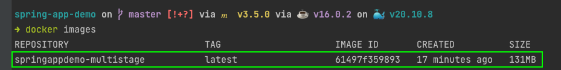
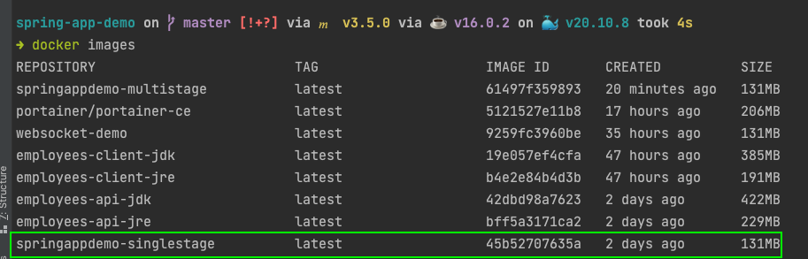
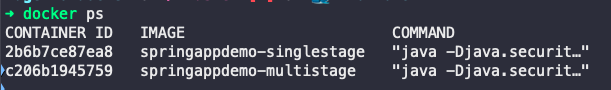
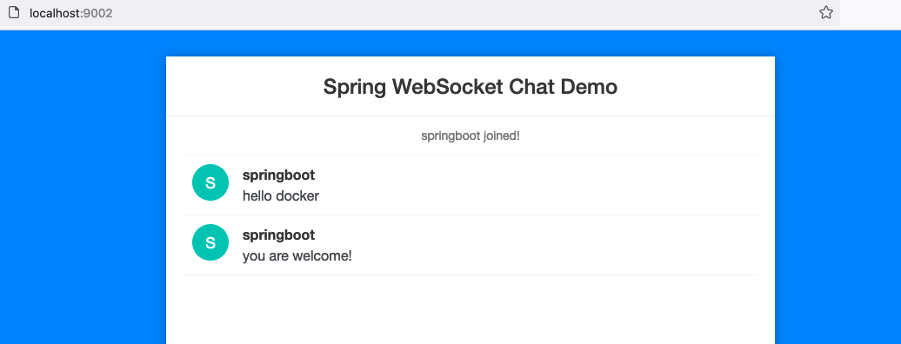

1.  Multi-Stage
    - Dockerfile
        
        - ```bash
              # Build Stage
              FROM maven:ibmjava-alpine AS builder
              COPY . .
              RUN mvn clean package -Dmaven.test.skip
              
              # Launch Stage
              FROM openjdk:8-alpine
              RUN mkdir /springboot-app
              ARG JAVA_FILE=target/*.jar
              WORKDIR /springboot-app
              COPY --from=builder ${JAVA_FILE} /springboot-app/
              CMD ["java", "-Djava.security.egd=file:/dev/./urandom", "-jar", "/springboot-app/websocket-demo-0.0.1-SNAPSHOT.jar"]
            ```
            
    - Build image
        
        - ```bash
              docker build -f Dockerfile -t springappdemo-multistage .
            ```
            
    - Kết quả:
        
        - 
2.  Single-Stage
    - Dockerfile.1
        
        - ```bash
              FROM openjdk:8-alpine
              ARG JAVA_FILE=target/*.jar
              COPY ${JAVA_FILE} .
              CMD ["java", "-Djava.security.egd=file:/dev/./urandom", "-jar", "websocket-demo-0.0.1-SNAPSHOT.jar"]
            ```
            
    - Build image
        
        - ```bash
              docker build -f Dockerfile.1 -t springappdemo-singlestage .
            ```
            
    - Kết quả:
        
        - 
3.  Start Image
    - ```bash
          docker run -d --name springappdemo-multistage-app -p 9002:8080 springappdemo-multistage
          docker run -d --name springappdemo-singlestage-app -p 9003:8080 springappdemo-singlestage
        ```
        
    - Kết quả:
        
        - 
        - 