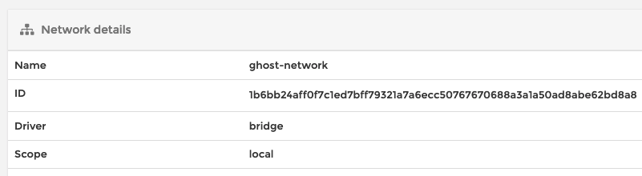
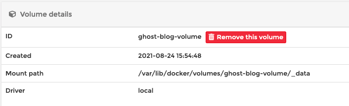
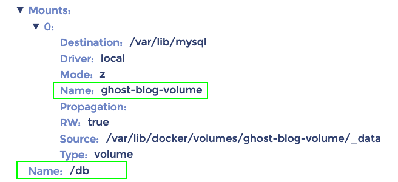
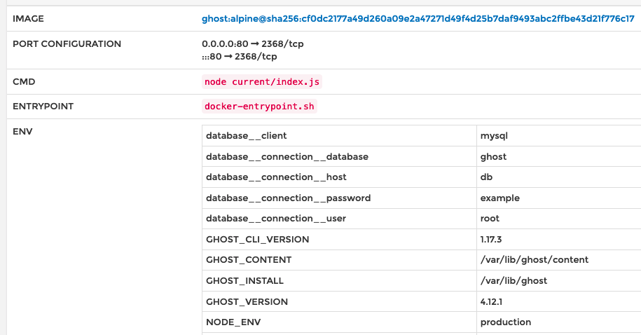
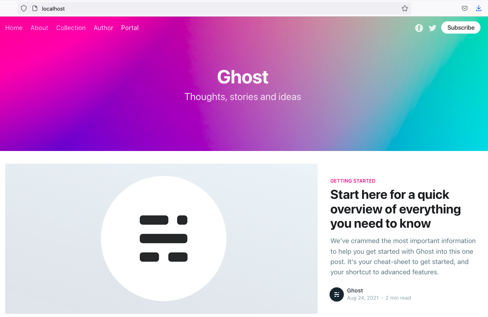

- Tạo network
    
    - ```bash
          docker network create ghost-network
        ```
        
    - Kết quả:
        
        - 
- Tạo volume
    
    - ```bash
          docker volume create ghost-blog-volume
        ```
        
    - Kết quả:
        
        - 
- Tạo container từ mysql:5.7
    
    - ```bash
              docker run -d \
              --name db \
              --net ghost-blog-volume \
              -v ghost-blog-volume:/var/lib/mysql \
              -e MYSQL_ROOT_PASSWORD=example \
              mysql:5.7
        ```
        
    - Kết quả:
        
        - 
- Tạo container từ ghost:alpine
    
    - ```bash
              docker run -d \
              --net ghost-network \
              -p 80:2368 \
              -e database__client=mysql \
              -e database__connection__host=db \
              -e database__connection__user=root \
              -e database__connection__password=example \
              -e database__connection__database=ghost \
              ghost:alpine
        ```
        
    - Kết quả:
        
        - 
- Ứng dụng chạy tại http://localhost:80
    - 